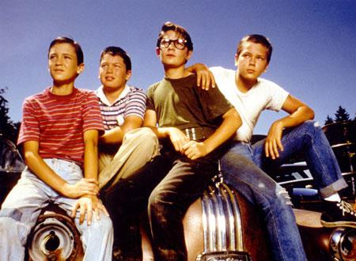

# stand by me をみた[WIP]

## あらすじ

ある日、主人公が新聞をみたら弁護士であるビーがレストランで首をナイフで刺されてなくなったというニュースを聞いた。そこで主人公は自身の幼少時代を思い返す。主人公にはいつも一緒に遊ぶ 5 人グループがある。その中の 1 人、シーが不良グループが盗んだ車で出かけているときに町外れの森の中で行方不明になっている子の遺体を発見したことを聞きつけた。その死体を発見すればヒーローになれると思い、少年たちは死体探しの旅を始めるのであった....

## おもしろいポイント

- 少年たちはヒーローになるために死体を探しの旅に出かけたが、匿名で警察に遺体のありかを話したこと
- 旅の途中で少年たちは大人になって、虚栄心がなくなったこと

## 感想

老若男女が楽しめる映画とはまさにこれだと思った。少年たちのアドベンチャー映画としてみても普通に思しろい。しかし、道具や自然、ストーリーを通じて作品が伝えたいメッセージの隠喩表現がたくさん散りばめられていて、それを１つ１つ丁寧に拾って何を表しているか考えてみてみるとさらに面白い。幼少時に観て、少年たちが旅に出かけてるストーリーで楽しめ大人になってもう一度観てみると幼少期には気づけなかった作品のメッセージのヒント解けて、より作品を理解できる二度美味しい映画。尾崎豊が 18 の青年が大人になる葛藤を代弁したように、stand by me は 12 の少年たちの大人へ行く不安や葛藤、成長を圧倒的にうまく描かれていた。

## 不良グループ

反面教師の役割をする。それゆえ、この作品が伝えたいことはこの不良グループを見ればわかる。主人公率いる少年グループが２日かけてたどり着いた死体の発見場所を、彼らは車を使って何の苦難もなく一瞬で辿り着いた。一方で少年たちは、旅の道中で意見の対立が起きたり、近道だと思って入った森に沼がたくさんあり、なかなか簡単に進むことができない。人生はショートカットするのではなく、遠回りするもの。そんなことを作品が教えてくれた。

## ビーの人生と主人公の人生

幼い頃の友達は自然とバラバラになってしまう。だが、そのときの原体験は後の自分の人生に影響を与える。SNS で繋がることがなかった当時、幼い頃の人の繋がりは薄かったかもしれないけど、一期一会の大切さを昔の人は噛み締めているではないかと思いふけた。忘れるからこそ価値が生まれる。離れてしまうからこそ大切に思う。そんな矛盾を私たちは持っている。
